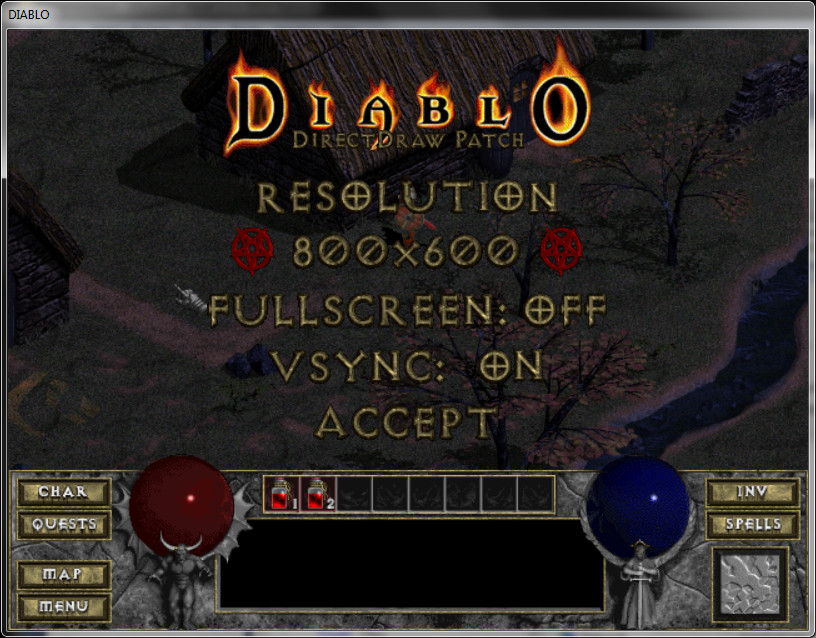

## Synopsis

Graphics fix for Diablo 1. Fixes various graphical issues and adds some features. Also includes a graphical interface for options selection.

* Window and Full Screen Mode
* No Corrupted Desktop Colors
* Multiple Resolutions in Window Mode and Fullscreen
* V-Sync On/Off
* Screenshots Saved as PNG Files
* Proper Aspect Ratio in Full Screen Mode
* Easy In-game Menu Configuration Of Video Settings
* Should Work With All Versions and Expansions (Tested with Diablo 1.0, 1.09, Hellfire 1.0)

## Motivation

This was an attempt to create a graphical fix for Daiblo 1 that does absolutely no modification of the game binary files. It only exists as a modified version of the DirectDraw library that is then loaded by the game at runtime. This allows it to potentially work with any version of Diablo including the expansion.

## Known Issues

* Slight Refresh Problems in the Main Menu
* Can Not Be Used For Play on Battle.net
* Can Only Access In-game Video Settings While Playing (not in main menu)

## Usage

Run the game with command line options
* /ddrawlog to write debug messages to ddraw_debug.log
* /ddrawdebug to write debug messages to a console

Press the ~ key to open the in-game graphics setting menu. Use the arrow keys to navigate/change settings and enter to apply. Escape will exit the menu without applying settings.

Press Alt + Enter to toggle between fullscreen and window mode quickly

Press Print Screen to take a screenshot, it will be saved in the game run directoy with the same file name as a normal screenshot but in PNG format. All screenshots are saved in native game resolution (640x480).

## Source Code Notes

DirectDraw functions actually used by the game are implemented in a minimalist way. Many unused functions are partially implemented and commented for future development, some are left as unimplemented. This is not in any way a complete implementation of the DirectDraw library.

## Build Instructions

Required For Building
* Visual C++ Express 2010 or newer
* [DirectX SDK](https://www.microsoft.com/en-us/download/details.aspx?id=6812)
* [Microsoft Detours Library](https://www.microsoft.com/en-us/research/project/detours/)

Successfully built and tested with Microsoft Visual Studio Community 2017

Note: Default project copies ddraw.dll into C:\Diablo on compile